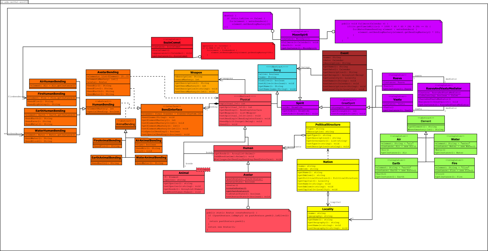

# Avatar Universe: Advanced Architecture with Design Patterns in Java

> An academic project that models the Avatar universe using an advanced architecture with Design Patterns to create a cohesive, flexible, and loosely coupled system.

---

## 📜 About the Project

This project was developed for the **Software Engineering** course and aims to practically apply a set of Design Patterns in a well-known domain: the Avatar universe.

The system explores concepts such as primordial spirits, the nature of elements, and different bending styles, demonstrating how the **Singleton, Mediator, Strategy, Proxy**, and **Static Factory Method** patterns can be combined to build robust and elegant software.

### 🎯 Key Features

- **Object-Oriented Modeling** of the Avatar universe including humans, animals, spirits, and nations
- **Element Bending System** with support for Water, Earth, Fire, and Air bending
- **Avatar State Management** with reincarnation cycle tracking
- **Spiritual Entities** including Raava, Vaatu, and the Moon Spirit
- **Event System** for modeling significant occurrences in the Avatar world
- **Political Structures** and geographical locations

---

## 🚀 Getting Started

### Prerequisites

- Java 17 or higher
- Maven 3.6+

### Building the Project

```bash
# Clone the repository
git clone https://github.com/lipe-pedras/avatar-universe.git
cd avatar-universe

# Compile the project
mvn clean compile

# Run the application
mvn exec:java -Dexec.mainClass="br.edu.unifei.ecot12.App"
```

---

## 🎨 Class Diagram

The project architecture was designed to be modular and extensible. The class diagram below illustrates the main entities and their relationships.



---

## 🧠 Design Patterns Applied

The backbone of this project is the combined use of multiple Design Patterns to manage state, behavior, and resource access.

### 1. Singleton (Creational Pattern)

**Purpose:** Ensure a class has only one instance and provide a global point of access to it.

**Application in the Project:** Several entities in the Avatar universe are inherently unique. The Singleton pattern was used to model this characteristic:

- **Spirits and Cosmic Entities:** The `Raava`, `Vaatu`, `MoonSpirit`, and `SozinComet` classes are Singletons, as they represent unique and indivisible entities in the universe's lore.
- **Fundamental Elements (Memory Optimization):** The `Air`, `Water`, `Fire`, and `Earth` classes are implemented as Singletons primarily for **memory economy**. Since all their attributes and methods are static, there's no reason to create multiple instances. Also, each element represents a shared, immutable concept in the universe - the element itself doesn't change, only how benders interact with it. Using Singleton ensures efficient memory usage while maintaining the semantic correctness of having only one instance of each fundamental element.
- **Mediator:** The `RaavaAndVaatuMediator` class, mediating the interaction between two Singletons, is also a Singleton to ensure a single control point for this communication.

**Benefits:**
- **Memory efficiency** - Prevents unnecessary object instantiation for static entities
- **Conceptual accuracy** - Models the unique nature of fundamental elements
- **Global access** - Provides a consistent way to access these shared resources

**Example:**
```java
Raava raava = Raava.getInstance();
Vaatu vaatu = Vaatu.getInstance();
```

### 2. Mediator (Behavioral Pattern)

**Purpose:** Reduce coupling between a set of objects by encapsulating how they interact through a central mediator object.

**Application in the Project:** In the Avatar universe, `Raava` and `Vaatu` represent the primordial forces of **good and evil**, light and darkness. Their powers are intrinsically **coupled** - when Vaatu's power increases, Raava's decreases proportionally, and vice versa. This represents the eternal balance between order and chaos.

- The **`RaavaAndVaatuMediator`** class acts as the mediator, managing this inverse relationship between the two spirits. Instead of `Raava` and `Vaatu` directly modifying each other's strength (which would create tight coupling), the mediator centralizes this balancing logic.
- When one spirit's power changes, the mediator automatically adjusts the other's power to maintain the cosmic balance, ensuring that their combined power represents the total spiritual energy in the universe.

**Benefits:**
- **Decouples** Raava and Vaatu - they don't need direct references to each other
- **Centralizes** the power balance algorithm in one place
- **Simplifies maintenance** - changes to the balance logic only affect the mediator

**Example:**
```java
Raava raava = Raava.getInstance();
Vaatu vaatu = Vaatu.getInstance();
RaavaAndVaatuMediator mediator = RaavaAndVaatuMediator.getInstance();

raava.setStrength(70); // Mediator automatically sets Vaatu's strength to 30
System.out.println(vaatu.getStrength()); // Outputs: 30
```

### 3. Strategy (Behavioral Pattern)

**Purpose:** Define a family of algorithms, encapsulate each one, and make them interchangeable.

**Application in the Project:** The world of Avatar has many types of physical beings - **Humans, Avatars, Animals** - and each has a **different algorithm for bending**. Even within the same element, the bending technique varies:

- A **Human** waterbender uses waterbending differently than an **Animal** waterbender
- An **Avatar** can bend all four elements

The Strategy pattern solves this elegantly:

- The `Physical` class (context) contains a reference to a bending strategy (`BendInterface`)
- Concrete strategies exist for each combination:
  - `WaterHumanBending`, `WaterAnimalBending`
  - `FireHumanBending`, `FireAnimalBending`
  - `AirHumanBending`, `AirAnimalBending`
  - `EarthHumanBending`, `EarthAnimalBending`
  - `AvatarBending`, `AvatarBending`
- When a being calls `bend()`, it delegates to its specific strategy, which executes the appropriate algorithm for that being type

**Advantages:**
- **Encapsulates behavior variation** - each being type has its own implementation
- **Easy to extend** - adding new being types or bending styles is simple
- **Runtime flexibility** - bending behavior can be changed dynamically

**Example:**
```java
// Human waterbender
Human katara = new Human();
katara.setBending(new WaterHumanBending());
katara.bend(); // Executes human waterbending algorithm

// Animal waterbender - different algorithm, same element
Animal<Water> unagi = new Animal<>(Water.getInstance());
unagi.setBending(new WaterAnimalBending());
unagi.bend(); // Executes animal waterbending algorithm

// Avatar - can bend all elements
Avatar aang = Avatar.createAvatar();
aang.setBending(new AvatarBending(aang));
aang.bend(); // Executes avatar-specific omnibending algorithm
```

### 4. Proxy (Structural Pattern)

**Purpose:** Provide a surrogate or placeholder for another object to control access to it.

**Application in the Project:** The Proxy manages the relationship between a Bender (client) and the Element Singleton (service/resource).

- Instead of the Bender accessing the Element directly, they do so through a Proxy.
- This Proxy can control access, manage a connection, or simply abstract the complexity of the real Element object. It acts as an "ambassador" of the Element to the Bender.

**Benefits:**
- Controls access to singleton Element instances
- Adds an abstraction layer between benders and elements
- Can implement lazy initialization and access control

### 5. Static Factory Method (Creational Pattern)

**Purpose:** Use a static method to encapsulate object creation logic, offering a more flexible and descriptive alternative to a public constructor.

**Application in the Project:** The **`Avatar.createAvatar()`** method is a classic example of this pattern. Instead of exposing a constructor (`new Avatar()`), the `Avatar` class centralizes creation in a single point, allowing the implementation of complex business rules:

1. **Instance Control:** The method's internal logic ensures that only one instance represents the currently "alive" Avatar, returning the current Avatar if still alive when a new one attempts to be created.
2. **Lifecycle Management:** By restricting and controlling Avatar instances, it's possible to ensure the functioning of the `pastAvatars` stack, which contains all Avatars instantiated in the code, representing the connection they had with each other.

**Advantages:**
- Makes code more expressive (`Avatar.createAvatar()` vs. `new Avatar()`)
- Centralizes critical business rules
- Abstracts the complexity of the creation process from the client
- Implements the Avatar reincarnation cycle

**Example:**
```java
Avatar aang = Avatar.createAvatar();
aang.setName("Aang");
aang.setAlive(false);

Avatar korra = Avatar.createAvatar(); // Returns a new Avatar instance
```

---

## 📦 Project Structure

```
avatar-universe/
├── src/main/java/br/edu/unifei/ecot12/
│   ├── App.java                      # Main application entry point
│   ├── Avatar.java                   # Avatar class with Static Factory Method
│   ├── Human.java                    # Human beings class
│   ├── Animal.java                   # Animal class
│   ├── Spirit.java                   # Spirit class
│   ├── Element.java                  # Abstract Element class
│   ├── Air.java                      # Air Element Singleton
│   ├── Water.java                    # Water Element Singleton
│   ├── Fire.java                     # Fire Element Singleton
│   ├── Earth.java                    # Earth Element Singleton
│   ├── BendInterface.java            # Bending Strategy interface
│   ├── *Bending.java                 # Concrete bending strategies
│   ├── Raava.java                    # Raava Spirit Singleton
│   ├── Vaatu.java                    # Vaatu Spirit Singleton
│   ├── RaavaAndVaatuMediator.java    # Mediator between Raava and Vaatu
│   ├── Nation.java                   # Nation class
│   ├── Locality.java                 # Geographic location class
│   └── Event.java                    # Event class
├── pom.xml                            # Maven configuration
└── README.md                          # This file
```

---

## 🌟 Example Usage

The `App.java` file demonstrates the system in action, recreating iconic scenes from the Avatar series:

```java
// Create characters
Avatar aang = Avatar.createAvatar();
aang.setName("Aang");
aang.setBending(new AvatarBending(aang));

Human katara = new Human();
katara.setName("Katara");
katara.setBending(new WaterHumanBending());

// Execute bending
aang.bend();
katara.bend();

// Demonstrate Avatar reincarnation cycle
aang.setAlive(false);
Avatar korra = Avatar.createAvatar(); // Returns new Avatar instance
```

---

## 🎓 Educational Value

This project demonstrates:

- **Practical application of Design Patterns** in a cohesive system
- **Object-Oriented Design principles** (SOLID, DRY, KISS)
- **Separation of concerns** through proper use of patterns
- **Low coupling and high cohesion** in software architecture
- **Domain modeling** of a complex fictional universe

---

## 📝 License

This project is licensed under the terms specified in the LICENSE file.

---

## 👨‍💻 Author

**lipe-pedras**
- GitHub: [@lipe-pedras](https://github.com/lipe-pedras)

---

## 🙏 Acknowledgments

- Developed as part of the Software Engineering course at UNIFEI (Universidade Federal de Itajubá)
- Inspired by the Avatar: The Last Airbender and The Legend of Korra series
- Built to demonstrate the practical application of Design Patterns in Java

